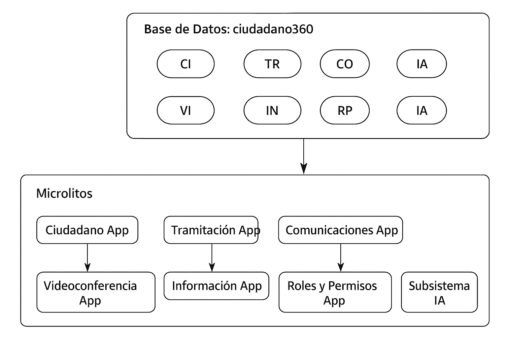

# Ciudadano 360

Proyecto multi-módulo basado en **Spring Boot 3**, **Java 17** y **PostgreSQL/PostGIS**, orientado a la gestión integral de la relación entre la administración y la ciudadanía.

El sistema sigue una arquitectura de **microlitos**: cada subsistema es un módulo Maven independiente y se despliega en un puerto distinto, pero todos comparten una **base de datos única** con esquemas separados. Esto aporta modularidad sin la complejidad de microservicios puros.

---

## 🚀 Inicio Rápido

### Prerrequisitos
- Java 17+
- Maven 3.8+
- Docker y Docker Compose

### Ejecución Automática (Recomendado)

**Windows (PowerShell):**
```powershell
.\build-and-run.ps1 dev      # Solo base de datos
.\build-and-run.ps1 docker   # Todos los servicios
.\build-and-run.ps1 prod     # Construcción para producción
```

**Linux/Mac:**
```bash
./build-and-run.sh dev       # Solo base de datos
./build-and-run.sh docker    # Todos los servicios
./build-and-run.sh prod      # Construcción para producción
```

### Ejecución Manual

#### 1. Levantar base de datos
```bash
docker compose up -d postgres
```

#### 2. Ejecutar un microlito
```bash
mvn spring-boot:run -pl subsistema-empleado
```

Swagger disponible en:  
[http://localhost:8082/swagger-ui.html](http://localhost:8082/swagger-ui.html)

---

## 💻 Arquitectura Técnica

### Stack Tecnológico
- **Backend**: Spring Boot 3.3.3, Java 17
- **Base de Datos**: PostgreSQL 15 + PostGIS
- **Migraciones**: Flyway
- **Documentación**: SpringDoc OpenAPI (Swagger)
- **Mapeo**: MapStruct
- **Utilidades**: Lombok
- **Cobertura**: JaCoCo

### Configuración de Entornos
- **Desarrollo**: `application-dev.yml`
- **Docker**: `application-docker.yml`
- **Producción**: `application-prod.yml`

### Monitoreo y Métricas
- **Health Checks**: Spring Boot Actuator
- **Métricas**: Micrometer + Prometheus
- **Logging**: Configuración por entornos

---

## 📦 Subsistemas y Puertos

| Subsistema                     | Puerto | Swagger URL |
|--------------------------------|--------|-------------|
| ciudadania360-app (agregador) | 8080   | [Swagger](http://localhost:8080/swagger-ui.html) |
| subsistema-ciudadano           | 8082   | [Swagger](http://localhost:8082/swagger-ui.html) |
| subsistema-tramitacion         | 8083   | [Swagger](http://localhost:8083/swagger-ui.html) |
| subsistema-comunicaciones      | 8084   | [Swagger](http://localhost:8084/swagger-ui.html) |
| subsistema-videoconferencia    | 8085   | [Swagger](http://localhost:8085/swagger-ui.html) |
| subsistema-informacion         | 8088   | [Swagger](http://localhost:8088/swagger-ui.html) |
| gestion-roles-permisos         | 8089   | [Swagger](http://localhost:8089/swagger-ui.html) |
| subsistema-ia                  | 8090   | [Swagger](http://localhost:8090/swagger-ui.html) |

---

## 🗂️ Subsistemas

- **ciudadania360-app** → Agregador principal que coordina todos los microlitos.
- **subsistema-ciudadano** → Gestión de ciudadanos, solicitudes, interacciones, clasificaciones y ubicaciones.
- **subsistema-tramitacion** → Gestión de expedientes, procesos BPM y tareas BPM.
- **subsistema-comunicaciones** → Envío de notificaciones multicanal (email, SMS, push).
- **subsistema-videoconferencia** → Planificación y gestión de videollamadas con ciudadanos.
- **subsistema-informacion** → Gestión de datasets, sugerencias y fuentes de datos externas.
- **gestion-roles-permisos** → Seguridad, control de accesos y perfiles de usuario.
- **subsistema-ia** → Procesamiento y análisis de datos mediante IA (NLP, LLM, clasificación, resumen).
    - **IAClient**: librería / cliente que consumen los demás microlitos para invocar los servicios de IA.

---

## 🔧 Desarrollo

### Estructura del Proyecto
```
ciudadania360-app/
├── shared/                          # DTOs y utilidades comunes
├── subsistema-ciudadano/            # Gestión de ciudadanos
├── subsistema-tramitacion/          # Procesos BPM
├── subsistema-comunicaciones/       # Notificaciones
├── subsistema-videoconferencia/     # Videollamadas
├── subsistema-informacion/          # Contenidos y datasets
├── gestion-roles-permisos/          # Seguridad
├── subsistema-ia/                   # IA y LLM
├── docker-compose.yml               # Infraestructura
├── build-and-run.ps1                # Script Windows
└── build-and-run.sh                  # Script Linux/Mac
```

### Comandos Útiles

**Construir proyecto completo:**
```bash
mvn clean install -DskipTests
```

**Ejecutar tests:**
```bash
mvn test
```

**Limpiar recursos:**
```bash
docker compose down -v
mvn clean
```

**Ver logs de un servicio:**
```bash
docker compose logs -f subsistema-empleado
```

---

## ✅ Estado del Proyecto

| Funcionalidad                    | Estado |
|---------------------------------|--------|
| Estructura base                  | ✅ Completamente implementada |
| Entidades y APIs                 | ✅ Implementadas en todos los subsistemas |
| Base de datos con esquemas       | ✅ Configurada |
| Docker                            | ✅ Configuración completa para desarrollo |
| Swagger / OpenAPI                 | ✅ Cada subsistema documentado |
| Subsistema IA + IAClient          | ✅ Implementado, endpoints disponibles |
| Tests unitarios                   | ✅ Implementados |
| Tests integración                 | ⚠️ Parcial, pendiente completar |
| CI/CD                             | ❌ Pendiente de implementación |
| Monitoreo centralizado            | ❌ Pendiente de integración |
| Seguridad (OAuth2, Keycloak)      | ⚠️ OAuth2 configurado, Keycloak pendiente |
| Integraciones externas (BPM, LLM, proveedores) | ❌ Pendientes |

---

## 📊 Integración y Flujo de IA



## 🤝 Contribución

1. Fork el proyecto
2. Crea una rama para tu feature (`git checkout -b feature/AmazingFeature`)
3. Commit tus cambios (`git commit -m 'Add some AmazingFeature'`)
4. Push a la rama (`git push origin feature/AmazingFeature`)
5. Abre un Pull Request

---

## 📝 Licencia

Este proyecto está bajo la Licencia MIT. Ver el archivo `LICENSE` para más detalles.

